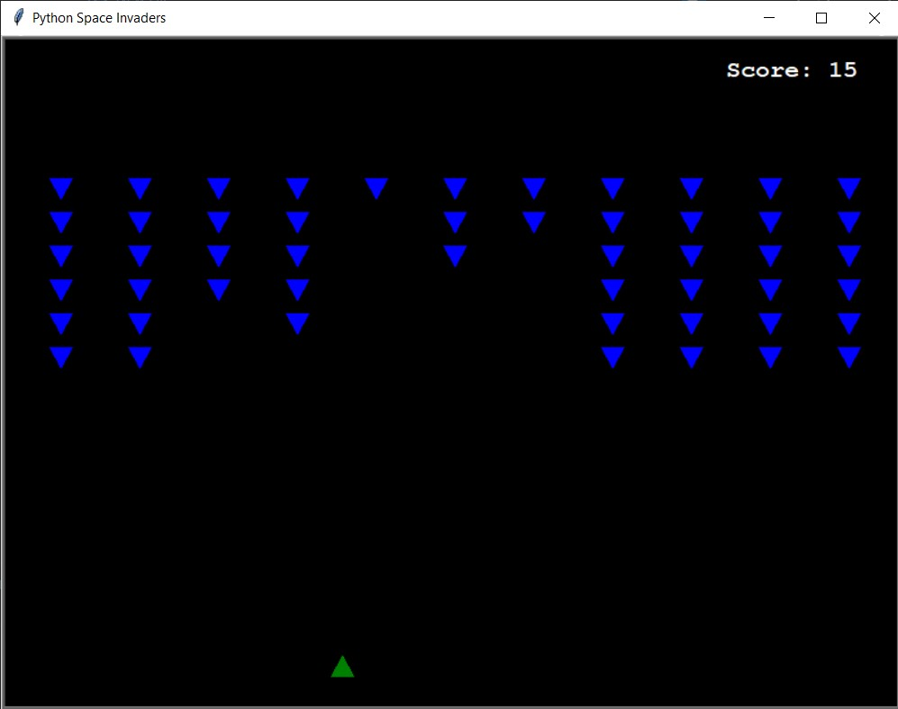

# Space Invaders 👾


> **Réimplémentation moderne** du classique Space Invaders utilisant la bibliothèque graphique Turtle de Python. Focus sur la programmation orientée objet (POO) et une boucle de jeu fluide.

## 🎯 Objectif du projet

Ce projet démontre des compétences avancées en architecture logicielle Python, notamment :
- **Programmation Orientée Objet (POO)** : Utilisation de l'héritage et de la composition pour gérer les entités du jeu (Vaisseau, Aliens, Projectiles).
- **Game Design** : Implémentation d'une boucle de jeu (Game Loop) performante avec gestion des collisions et du rafraîchissement d'écran.
- **Clean Code** : Code source entièrement refactorisé, documenté et typé.

## 📸 Screenshots



## ✨ Fonctionnalités

- 🚀 **Contrôles Fluides** : Déplacement du vaisseau via les touches fléchées et tir avec `Espace`.
- 👽 **IA Ennemie** : Mouvement automatique et descendant des vagues d'aliens.
- 🎯 **Système de Collision** : Détection précise entre projectiles et entités.
- 🏆 **Scoreboard** : Affichage du score en temps réel et messages de fin de partie.
- 🛠️ **Architecture Propre** : Séparation stricte des responsabilités entre les classes.

## 🛠️ Technologies

- **Python 3.8+**
- **Turtle Graphics** (Moteur de rendu)
- **Time** (Gestion du framerate)

## 🚀 Installation

### Prérequis
- Python 3 installé sur votre machine.

### Lancement
```bash
# Cloner le dépôt
git clone https://github.com/votre-username/space-invaders-python.git
cd space-invaders-python

# Lancer le jeu
python src/main.py
```

## 📖 Comment jouer ?

- **Flèche Gauche / Droite** : Déplacer le vaisseau.
- **Espace** : Tirer un projectile.
- **Objectif** : Détruisez tous les aliens avant qu'ils n'atteignent votre position !

## 🧠 Compétences démontrées

- **Gestion de la Concurrence** : Utilisation de `ontimer` pour les mouvements asynchrones des aliens.
- **Optimisation Graphique** : Utilisation de `tracer(0)` et `update()` pour éliminer le scintillement (flickering).
- **Lifecycle Management** : Gestion du cycle de vie des objets (nettoyage des projectiles hors écran).
- **Typage Statique** : Utilisation massive de `Type Hints` pour une meilleure robustesse.

## 🏗️ Architecture du projet

```text
space-invaders-python/
├── src/
│   ├── main.py          # Contrôleur principal du jeu
│   ├── spaceship.py     # Classe du joueur
│   ├── alien.py         # Classe des ennemis
│   ├── bullet.py        # Gestion des projectiles
│   └── scoreboard.py    # Affichage du score et messages
├── assets/
│   └── screenshots/     # Médias du projet
├── .gitignore
├── requirements.txt
├── LICENSE
└── README.md
```

## 📄 License

MIT License - Voir LICENSE

## 📧 Contact

**Adamou**  
📧 adam00soumana@gmail.com  
🔗 [LinkedIn](https://www.linkedin.com/in/adamou-soumana-a6537a346/)  
🌐 [Portfolio](https://adamou-portfolio.onrender.com/)
